 

  

  

 

BUILD • VERIFY • SHIP • REPEAT

---

### 8th UEC ASEAN Seminar & Workshop 2026

  

**AI-driven and LLM-based assistant smart inventory management system with RFID and IoT**

 

`ESP32` → `RFID` → `IoT` → `INVENTORY` → `AUDIT TRAIL` → `ANALYTICS` → `AI` → `LLM`

  

The only undergraduate recipient among participating Master’s and Doctoral students.

---

### VEHICLECHAIN

 

  

Blockchain-based vehicle service, warranty and dispute management platform.

  

  

  

---

### MILANSOFTWARE

  

**Quotation platform built for a real business workflow.**

 

  

`MOBILE APP` → `BACKEND` → `WEB DASHBOARD` → `BUSINESS WORKFLOW`

  

Working now: quotation workflows • mobile application • web dashboard

 

Next: floor plan recognition • AI workflows • LLM integration

---

  

  

Contributing to software beyond personal repositories.

---

  

  

  

  

---

  

  

Multilingual communication across technical, academic and professional environments.

---

  

  

I don't chase impressive-looking code.

 

<strong>I chase working systems.</strong>

---

  

  

---

  

  

 

  

ENGINEER • BUILDER • RESEARCHER • OPEN SOURCE CONTRIBUTOR

  

